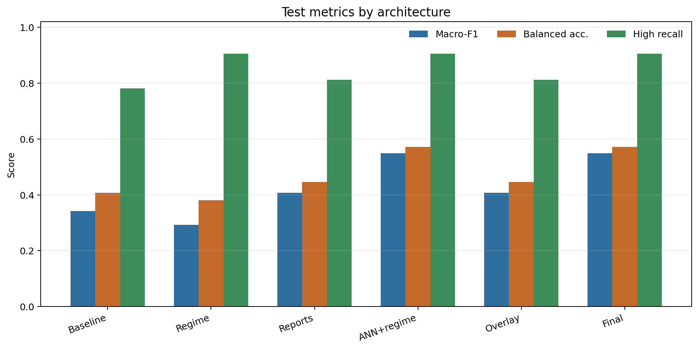
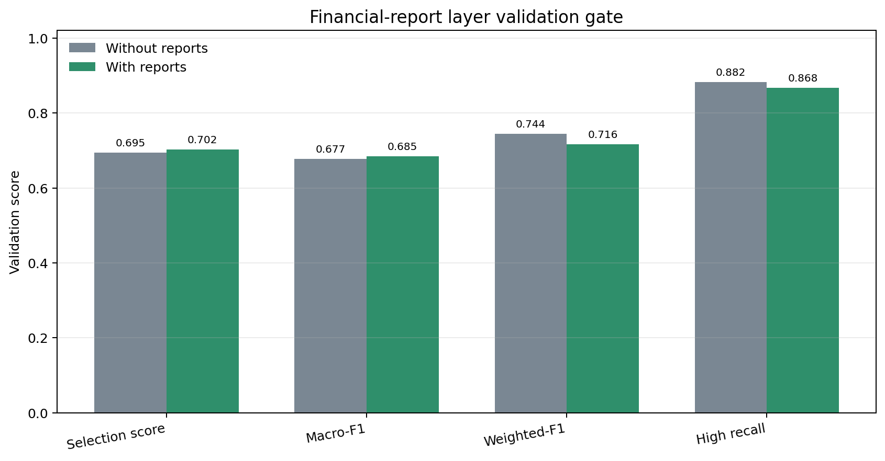
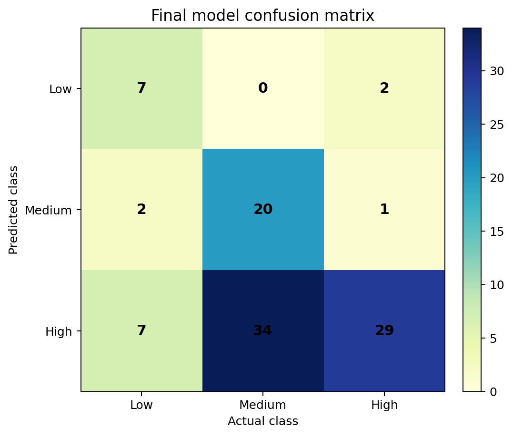
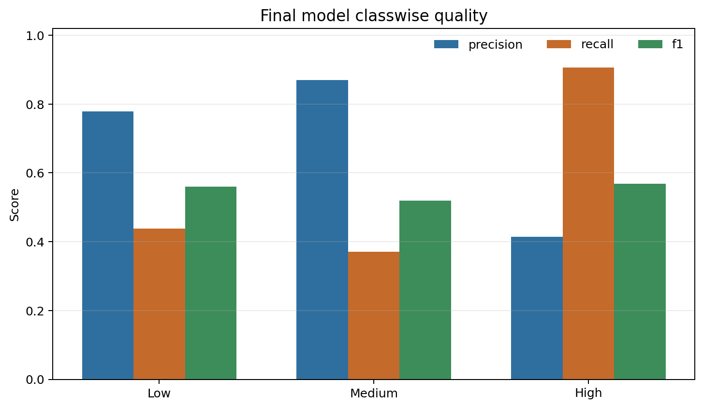
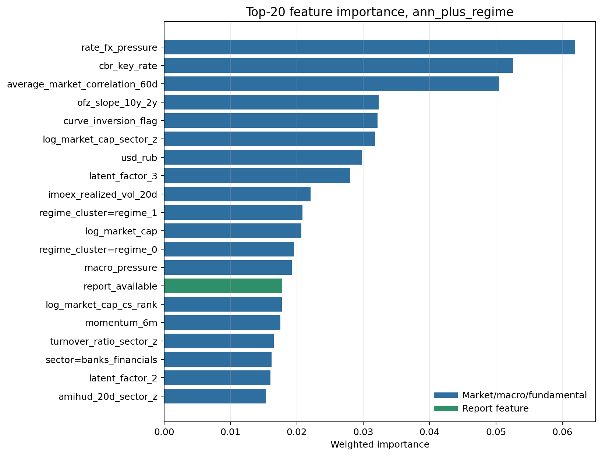
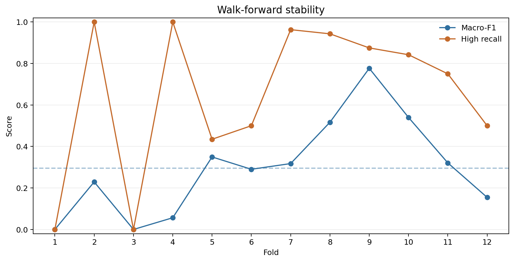
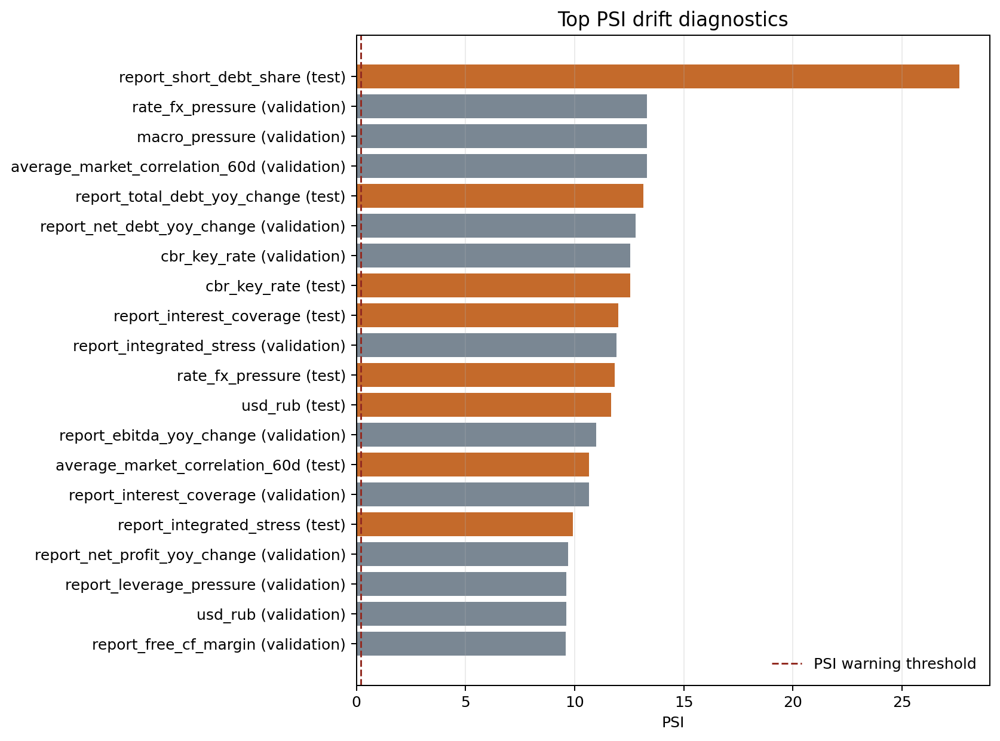

# Материалы для защиты диплома

## 1. Короткий вывод

В работе реализован воспроизводимый point-in-time pipeline классификации инвестиционного риска российских акций на три класса: `low`, `medium`, `high`. Финальная версия использует рыночные, ликвидностные, макроэкономические, фундаментальные признаки и признаки, извлеченные из финансовой отчетности эмитентов.

- Финальная выбранная архитектура: `ann_plus_regime`.
- Validation objective для выбора риск-ориентированных решений: `macro_f1 + 0.020 * high_recall`.
- Нейросетевой latent-factor backend: **`torch_linear_autoencoder_pca_init`**; reconstruction loss: **0.4852**.
- Test macro-F1: **0.5494**.
- Test weighted-F1: **0.5413**.
- Test balanced accuracy: **0.5714**.
- High-risk recall: **0.9062**; high-risk false negative rate: **0.0938**.
- Walk-forward: 12 folds, mean macro-F1 **0.2960**, mean high recall **0.6506**.
- Drift warnings: **129**, что показывает существенный сдвиг рынка между train и future-периодами.



## 2. Что было доработано перед защитой

1. Единая validation objective `macro_f1 + 0.020 * high_recall` используется для report-gate, настройки риск-ориентированных threshold и выбора финальной архитектуры.
2. Нейросетевой слой сделан реальным backend-компонентом в PyTorch: latent factors строятся через bottleneck autoencoder и сохраняются в model package.
3. Для малой финансовой панели выбран консервативный linear autoencoder с PCA-инициализацией. Это дает нейросетевой encoder/decoder без лишней нелинейной емкости, которая на такой выборке легко переобучается на один рыночный режим.
4. Soft-voting ensemble оптимизирует macro-F1, а бизнес-предпочтение к recall класса high вынесено в явные probability thresholds. Так проще объяснить, где качество классификации, а где риск-аппетит.
5. Подготовлены графики для комиссии: сравнение архитектур, ablation финотчетности, confusion matrix, classwise-метрики, feature importance, walk-forward и drift.

## 3. Данные и постановка задачи

- Train / validation / test: **248 / 102 / 102** наблюдений.
- Классы во всей размеченной выборке: low=270, medium=276, high=332.
- Пороги RiskScore: low <= **0.3589**, medium <= **0.6331**, выше - high.
- Добавлено engineered features: **53**.
- Split строго временной: train заканчивается 2024-08-30, validation начинается 2024-09-30, test начинается 2025-03-31.

Целевая переменная строится по будущему окну риска, но признаки берутся только на дату принятия решения или на дату уже опубликованной отчетности.

## 4. Финансовая отчетность эмитентов

- Report features present: **True**.
- Выбранный слой: **`with_reports`**.
- Количество report-признаков в модели: **60**.
- Validation selection score без отчетности: **0.6947**.
- Validation selection score с отчетностью: **0.7022**.
- Macro-F1 без отчетности: **0.6770**; с отчетностью: **0.6848**.



Интерпретация для защиты: отчетность не используется как свободная текстовая оценка. Она превращается в воспроизводимые числовые признаки: долговая нагрузка, покрытие процентов, cash-flow pressure, доля краткосрочного долга, признаки санкционного/валютного/ковенантного риска и stale/missing indicators. Присоединение выполняется point-in-time по `publish_date`, поэтому будущая отчетность не попадает в прошлые решения.

## 5. Сравнение архитектур

| Architecture | Macro-F1 | Weighted-F1 | Balanced acc. | High recall | High precision | High FN rate | Adjacent acc. |
|---|---:|---:|---:|---:|---:|---:|---:|
| baseline_rf | 0.3416 | 0.3106 | 0.4078 | 0.7812 | 0.3247 | 0.2188 | 0.8824 |
| regime_only | 0.2922 | 0.2817 | 0.3808 | 0.9062 | 0.3452 | 0.0938 | 0.9118 |
| enriched_reference | 0.4069 | 0.4202 | 0.4468 | 0.8125 | 0.3562 | 0.1875 | 0.8725 |
| ann_plus_regime | 0.5494 | 0.5413 | 0.5714 | 0.9062 | 0.4143 | 0.0938 | 0.9118 |
| sector_overlay | 0.4069 | 0.4202 | 0.4468 | 0.8125 | 0.3562 | 0.1875 | 0.8725 |
| final_selected | 0.5494 | 0.5413 | 0.5714 | 0.9062 | 0.4143 | 0.0938 | 0.9118 |

Финальная архитектура `ann_plus_regime` выбрана по validation objective `macro_f1 + 0.020 * high_recall`, а не по test: ее validation selection score равен **0.7077**, против **0.7022** у enriched-reference.

Нейросетевой компонент финальной ветки: **`torch_linear_autoencoder_pca_init`**. В этой конфигурации autoencoder не является PCA fallback: это PyTorch-модель с encoder/decoder, инициализированная устойчивыми главными компонентами, после чего ее latent factors используются как дополнительные признаки режима риска.

## 6. Ошибки классификации





| Class | Precision | Recall | F1 | Support |
|---|---:|---:|---:|---:|
| low | 0.7778 | 0.4375 | 0.5600 | 16 |
| medium | 0.8696 | 0.3704 | 0.5195 | 54 |
| high | 0.4143 | 0.9062 | 0.5686 | 32 |

Главный акцент: модель консервативна в отношении высокого риска. Для класса `high` recall равен **0.9062**, то есть модель редко пропускает высокий риск, но часть среднерисковых бумаг переводит в high.

## 7. Важность признаков



Среди важных факторов есть макро-рыночные признаки (`rate_fx_pressure`, `cbr_key_rate`, `average_market_correlation_60d`) и признаки отчетности, например `report_capex`, `report_staleness_weight` и report-derived stress features. Это хорошо защищается как гибридный подход: рыночный риск + финансовое состояние эмитента + режим рынка.

## 8. Устойчивость и drift





Наличие drift warnings не надо скрывать: это важный результат. Российский рынок в test-периоде отличается от train-периода, поэтому качество на test ниже validation. В работе это не замалчивается, а фиксируется через PSI, walk-forward и отдельные drift-отчеты.

## 9. Примерный текст защиты

Здравствуйте. В дипломной работе я разработал систему классификации инвестиционного риска российских акций. Задача формулируется не как прогноз доходности, а как отнесение бумаги на месячном срезе к одному из трех классов риска: low, medium или high.

Целевая переменная построена через будущий риск-скор, который учитывает максимальную просадку, downside volatility, CVaR 95% и неликвидность. При этом все признаки формируются point-in-time: на дату решения доступны только текущие рыночные данные, макроэкономика и уже опубликованная отчетность.

В выборке после разметки получилось 878 наблюдений: 270 low, 276 medium и 332 high. Разделение train-validation-test сделано строго по времени: 248 наблюдений в train, 102 в validation и 102 в test.

Отдельная часть работы - слой финансовой отчетности. Я извлекаю из отчетов не произвольные текстовые оценки, а воспроизводимые признаки: долговую нагрузку, покрытие процентов, денежные потоки, маржинальность, признаки санкционного, валютного, ковенантного и ликвидностного риска. Эти признаки присоединяются по дате публикации отчета, чтобы исключить заглядывание в будущее.

На validation я сравнил модель без отчетности и с отчетностью. Selection score вырос с 0.6947 до 0.7022, macro-F1 - с 0.6770 до 0.6848. Поэтому validation-gate выбрал вариант with_reports.

Нейросетевой блок в работе используется как latent-factor слой. Для текущего размера панели я выбрал не переусложненную нелинейную сеть, а bottleneck autoencoder в PyTorch с PCA-инициализацией: backend `torch_linear_autoencoder_pca_init`, reconstruction loss 0.4852. Так модель получает компактные скрытые факторы, но не подменяет проверяемую финансовую логику черным ящиком.

Финальная архитектура выбиралась по validation-метрике `macro_f1 + 0.020 * high_recall`. Победила архитектура `ann_plus_regime`. На test она дала macro-F1 0.5494, balanced accuracy 0.5714, high-risk recall 0.9062 и high-risk false negative rate 0.0938.

Для задачи риск-менеджмента я считаю особенно важным recall класса high: ошибка пропуска высокого риска дороже, чем ложное завышение риска. Поэтому модель сознательно консервативна: она лучше ловит high-risk бумаги, но иногда относит medium к high.

Устойчивость проверялась через walk-forward: 12 фолдов, средний macro-F1 0.2960, средний high recall 0.6506. Также рассчитан drift diagnostics: найдено 129 предупреждений PSI, что показывает сильное изменение распределений макро- и report-признаков между периодами.

Главный результат работы - не один классификатор, а воспроизводимый исследовательский pipeline: сбор и подготовка панели, point-in-time признаки, финансовая отчетность, temporal validation, walk-forward, drift diagnostics, сохранение model package и отдельная команда predict для инференса.

Ограничения работы я также фиксирую: выборка по российским акциям сравнительно мала, качество финансовой отчетности неоднородно, а рынок имеет сильный regime shift. Поэтому дальнейшие улучшения - расширение universe, улучшение парсинга отчетов и регулярное переобучение модели.

## 10. Что открыть на защите

1. Этот файл: `results/defense_run_architected/DEFENSE_MATERIALS.md`.
2. Графики из папки `results/defense_run_architected/defense_assets/`.
3. Полные метрики: `results/defense_run_architected/metrics.json`.
4. Предсказания test-периода: `results/defense_run_architected/predictions.csv`.
5. Сохраненный пакет модели: `results/defense_run_architected/model_package.joblib`.

Команда воспроизведения:

```bash
source .venv/bin/activate
risk-pipeline --config configs/config.example.yaml \
  run-model-ready \
  --input data/processed/monthly_model_ready.csv \
  --out results/defense_run_architected
.venv/bin/python scripts/make_defense_materials.py results/defense_run_architected
```
